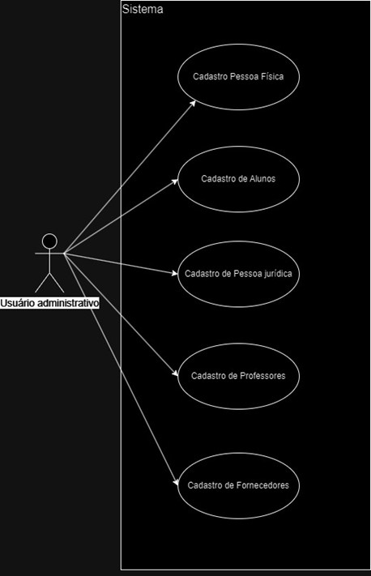
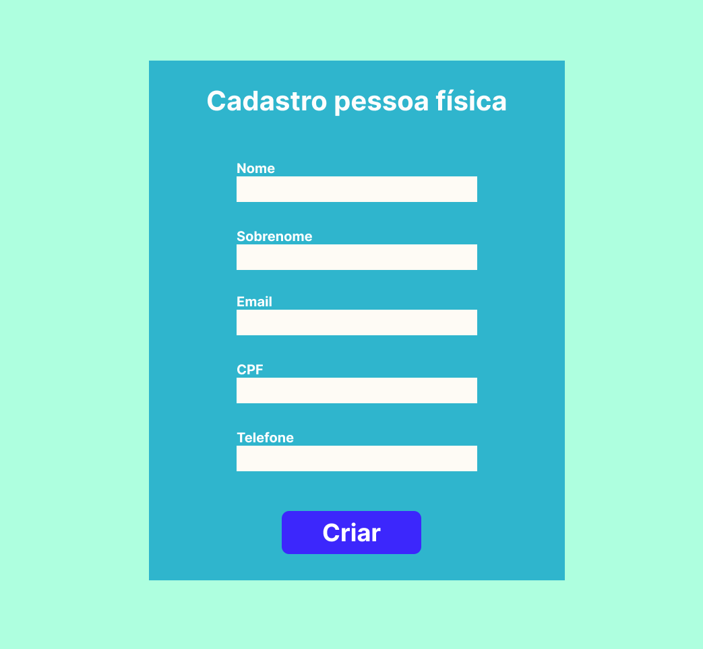
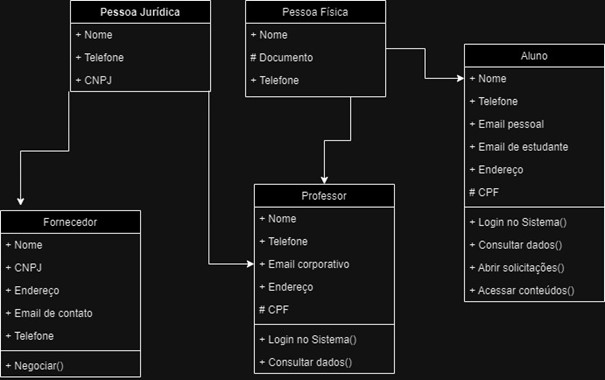

# PI_SENAC

## Diagrama de casos de uso

### Abaixo estão os diagramas de caso de uso criados para esse projeto

## 

### Para cada diagrama foram criadas interfaces visuais que representam o sistema

## Cadastro pessoa física

## Cadastro de alunos

## Diagrama de classes

